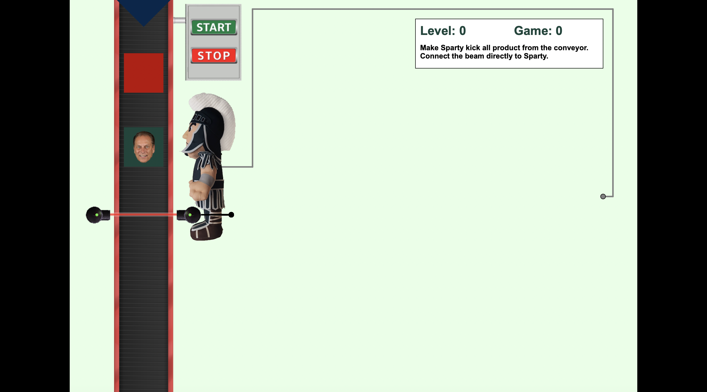
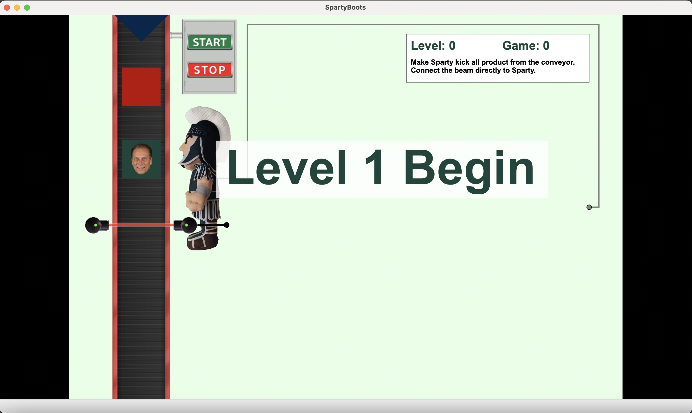
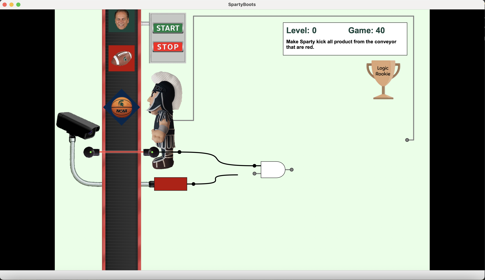
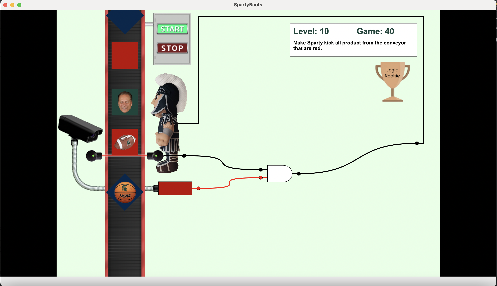
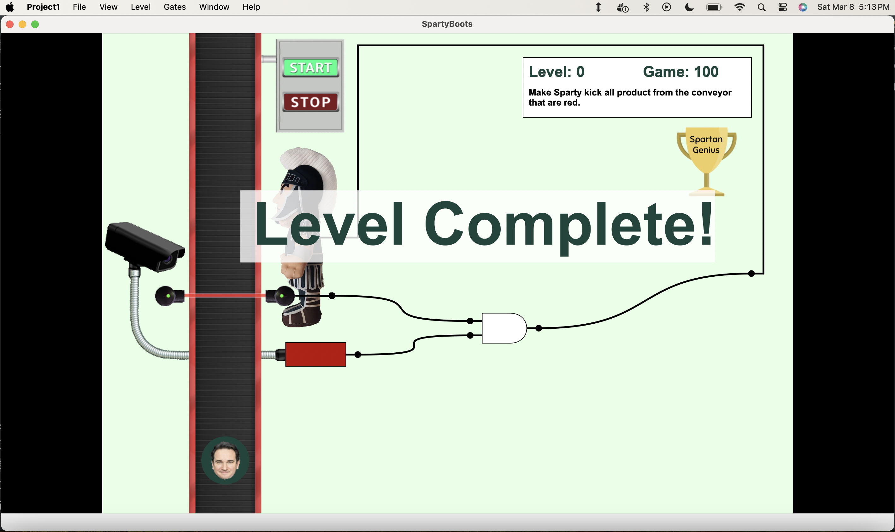
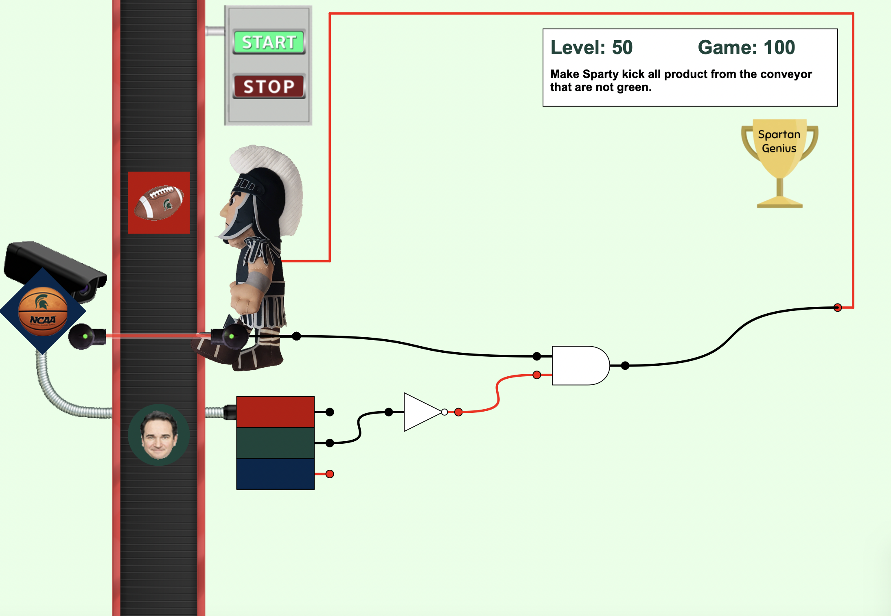
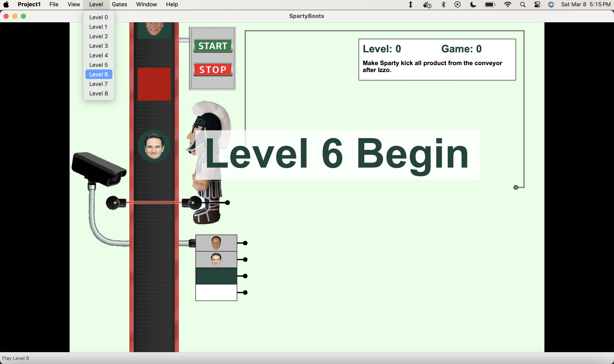

# Sparty's Boots

**Sparty’s Boots** is a logic-based puzzle game where you control Sparty’s powerful kicks using logic gates! Objects move along a conveyor belt, and your job is to set up the correct **logic gate combinations** to determine which ones Sparty kicks off.  

## How It Works  
1. **Sensors on the Conveyor** detect objects as they pass.  
2. **Logic Gates** (AND, OR, NOT, XOR, SR Flip FLops and D Flip Flops) process the sensor signals.  
3. **Sparty’s Boots** receive the final signal and kick objects based on your logic setup.  

## The Challenge  
Your goal is to design the **correct logic circuit** to kick only the **target objects** while letting others pass. As the game progresses, gate placement becomes more complex, testing your problem-solving skills. 

Think fast, wire smart, and make sure Sparty’s Boots only kick what they should! 

## Team  
- **Harshit Kandpal** – Developer
- **Nitish Maindoliya** – Developer
- **Shashank Singh** – Developer
- **Anas Shaaban** – Developer  
- **Bruno Budelmann** – Developer

## Features  
- **Smooth Animations:** Fluid movement and character interactions.  
- **Interactive Gameplay:** Engage with various objects in the environment.  
- **Visually Appealing UI:** Designed with clarity and ease of use in mind.  
- **Dynamic Elements:** Moving obstacles and interactive objects.  

## Screenshots  














## Installation & Setup  

### Prerequisites  
Before building and running *Sparty’s Boots*, make sure you have the following installed:  
- **C++ Compiler** (GCC, Clang, or MSVC)  
- **wxWidgets** (for UI components)  
- **CMake** (for building the project)  
- **CLion or another CMake-compatible IDE**  

### Build & Run  

1. **Clone the Repository**  
   ```bash
   git clone https://github.com/HarshitK150/spartys-boots.git
   cd spartys-boots
   
2. **Open the Project in CLion (or another IDE)**
  - Select **"Open"** and choose the project folder.  
  - Wait for **CMake** to configure the project.  

3. **Build & Run**
  - Click **"Build"** in the IDE to compile the project.  
  - Click **"Run"** to launch *Sparty’s Boots*!
    
The compiled application will be located in the cmake-build-release folder.

Now you're ready to play Sparty’s Boots!
